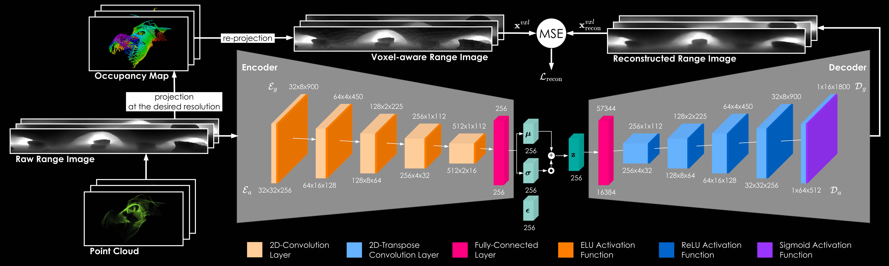
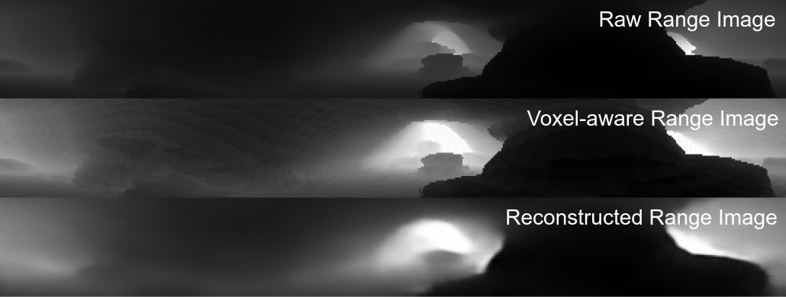

#  <div align="center">Task-Driven Point Cloud Compression for Volumetric Mapping</div>
<div align="center"> <a href="https://ntnu-arl.github.io/marsupial-collaborative-exploration/"></a>  <a href="https://ieeexplore.ieee.org/document/11159273"></a> <a href="https://arxiv.org/abs/2509.07655"></a> <a href="https://doi.org/10.5281/zenodo.18493894"></a> <a href="https://www.youtube.com/watch?v=VEYS5BjmZP8"></a> </div>

This repository contains the code for a bandwidth-efficient task-driven point cloud compression solution, developed as part of the paper titled _"Collaborative Exploration with a Marsupial Ground-Aerial Robot Team through Task-Driven Map Compression"_ .



We propose a bandwidth-efficient, task-driven point cloud compression method tailored for volumetric map reconstruction at mission-relevant resolutions. By emphasizing occupancy-relevant structure over raw point cloud fidelity, our approach achieves high compression rates while retaining the information essential for planning.

The proposed solution supports data gathered from two different LiDAR sensors:

* **Ouster OS0-64** (used by the aerial robot) 
* **Velodyne VLP-16** (used by the ground robot).


## Setup
#### Clone the repository
```bash
cd ~
git clone git@github.com:ntnu-arl/pcl-vae.git
```

#### Install
To install the repository, run the following commands:
```bash
cd ~/pcl_vae
pip3 install -e .
```

## Folder Description
The folders contain the following:

- **datasets**: Contain scripts that utilize pytorch's dataset class to read from dataset files
- **inference**: Contains the scripts for running the pcl_vae node
- **networks**: Contains the VAE networks, and the loss function for training the VAEs
- **weights**:  Contains the weights for the VAEs


## Datasets
For each robot, we provide a dataset containing both real and simulated range images from diverse environments, including caves, confined spaces, and complex buildings. Relevant files [here](https://figshare.com/s/ce4e4b87b3a28a75be27)

#### Download the datasets
```bash
cd ~/pcl-vae/pcl_vae/datasets/
wget -O datasets.zip "https://ndownloader.figshare.com/files/53055530?private_link=ce4e4b87b3a28a75be27"
unzip datasets.zip 
```

##### Aerial Robot Dataset
- Range images (`64×512 (H×W)`) generated by OS0-64 LiDAR sensor. 
- Includes $\sim36,000$ range images ($\sim26,000$ simulated)
- Training set ($90 \%$) and Testing set ($10 \%$)

##### Ground Robot Dataset
- Range images (`16×1800 (H×W)`) generated by VLP-16 LiDAR sensor. 
- Includes  $\sim25,000$ ($\sim21,000$ real).
- Training set ($90$%) and Testing set ($10$%)


## Run a demo with pre-trained models
For each robot, we provide pre-trained models with varying latent space size `{32,64,128,256,512,1024}` and voxel size `{0.2,0.3,0.4}m`. Relevant files [here](https://figshare.com/s/ce4e4b87b3a28a75be27)

#### Download pre-trained models
For aerial robot models
```bash
cd ~/pcl-vae/pcl_vae/weights/
wget -O aerial_robot_pcl_vae_models.zip "https://ndownloader.figshare.com/files/53083268?private_link=ce4e4b87b3a28a75be27"
unzip aerial_robot_pcl_vae_models.zip 
```

For ground robot models
```bash
cd ~/pcl-vae/pcl_vae/weights/
wget -O ground_robot_pcl_vae_models.zip "https://ndownloader.figshare.com/files/53083163?private_link=ce4e4b87b3a28a75be27"
unzip ground_robot_pcl_vae_models.zip 
```

#### Configure
To validate a pre-trained model, you need to modify the parameters in the configuration file to match the desired settings. For both robot types, a `vae_validation_config.yaml` file exists under the `inference/config/<robot-type>` folder with `<robot-type> = {aerial, ground}`. A detailed description of all parameters is included in the configuration file.

**Note:** Set `model name`, `latent_space`, and `voxel_size` variables in `inference/config/<robot-type>/vae_validation_config.yaml`.

#### Run
Run the following command specifying the robot type. Replace `<robot-type>` with `aerial` or `ground` for validate the the pre-trained model for aerial or ground robot, respectively.
```bash
cd pcl_vae/pcl_vae/inference/src
python3 vae_node_validation.py --robot_type=<robot-type>
```
An example of the output is shown in the figure below, which includes the raw range image input to the model, its voxel-aware representation, and the reconstructed range image. range_image_comparison


**Note:** To go through the entire dataset, press `n` to move from image to image.


## Training Models

#### Configure
To train a `pcl_vae` model, you need to modify the parameters in the configuration file to match the desired settings. For all robot types, a `train_config.yaml` file exists under the `train/config/<robot-type>` folder with `<robot-type> = {aerial, ground}`. A detailed description of all parameters is included in the configuration file.

#### Run
To start training the model, run the following command, specifying the robot type. Replace `<robot-type>` with aerial or ground for training a pcl_vae for aerial or ground robot, respectively.
```bash
cd ~/pcl_vae/pcl_vae/train
python3 train_pcl_vae.py --robot_type=<robot-type>
```
**Note:** The model is saved under the `train/weights/<robot-type>/<robot-type>_model` folder.


## Testing Models

#### Configure
To validate the trained model, you need to modify the parameters in the configuration file to match the desired settings. For both robot types, a `vae_validation_config.yaml` file exists under the `inference/config/<robot-type>` folder with `<robot-type> = {aerial, ground}`. A detailed description of all parameters is included in the configuration file.

**Note:** Move the trained model to `weights` folder, set `model name`, `latent_space`, and `voxel_size` variables in `inference/config/<robot-type>/vae_validation_config.yaml`.

#### Run
Run the following command specifying the robot type. Replace `<robot-type>` with `aerial` or `ground` for validate the the pre-trained model for aerial or ground robot, respectively.
```bash
cd pcl_vae/pcl_vae/inference/src
python3 vae_node_validation.py --robot_type=<robot-type>
```


## Citation
If you use this work in your research, please cite the following publication:

```bibtex
@article{zacharia2025collaborative,
  title={Collaborative Exploration with a Marsupial Ground-Aerial Robot Team through Task-Driven Map Compression},
  author={Zacharia, Angelos and Dharmadhikari, Mihir and Alexis, Kostas},
  journal={IEEE Robotics and Automation Letters},
  year={2025},
  publisher={IEEE}
}
```


## License
Released under BSD-3-Clause.

## Acknowledgements
This open-source release is based upon work supported by the **European Commission** through:
- **Project SYNERGISE** under the **Horizon Europe Grant Agreement No. 101121321**
- **Project SPEAR** under the **Horizon Europe Grant Agreement No. 101119774**
- **Project DIGIFOREST** under the **Horizon Europe Grant Agreement No. 101070405** 


## Contact
For questions or support, reach out via [GitHub Issues](https://github.com/ntnu-arl/pcl-vae/issues) or contact authors:

* [Angelos Zacharia](mailto:angelos.zacharia@ntnu.no)
* [Mihir Dharmadhikari](mailto:mihir.dharmadhikari@ntnu.no)
* [Kostas Alexis](mailto:konstantinos.alexis@ntnu.no)

---
